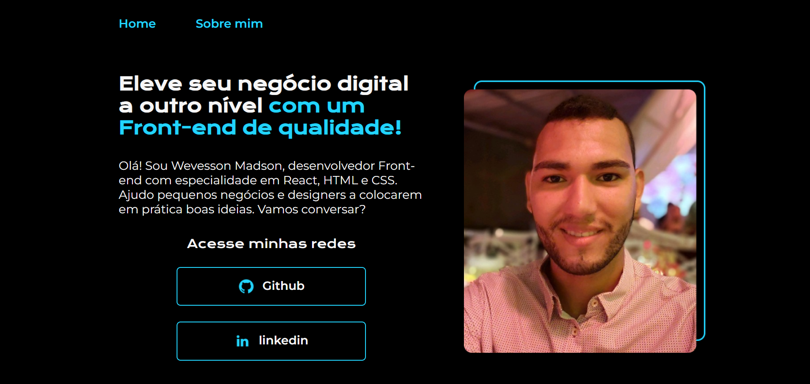

# Meu mini portifólio

- Este mini portifólio foi desenvolvido durante o curso de HTML5 + CSS3, da Alura.

- Ao desenvolver pratiquei mais o HTML e CSS, além de reforçar conceitos com outros pontos de vistas.

## Criado com:

- HTML
- CSS

 

[Acesso ao portifólio online](https://wevessonmadson.github.io/mini-portifolio/)

  

